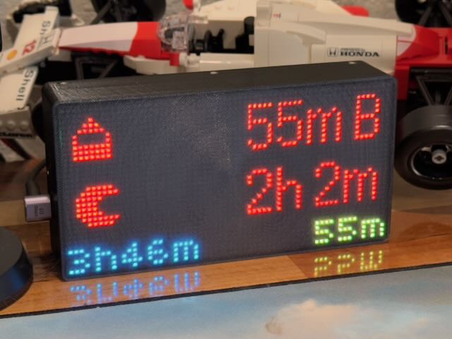

# MatrixPortal case with Baby Buddy software



This uses a [3D-printed LED matrix](https://github.com/skjdghsdjgsdj/matrixportal-case) that uses CircuitPython to show information from [Baby Buddy](https://github.com/babybuddy/babybuddy).

## Stuff you need

In addition to the electronics and printed enclosure from above, you need:

* An account on [adafruit.io](https://io.adafruit.com/). A free account is fine.
* [Baby Buddy](https://github.com/babybuddy/babybuddy) installed somewhere and accessible on the same Wi-Fi network as this device.
* A user added to Baby Buddy who can view information and who has an API key created.

## Setup

1. Buy all the electronics including the RTC and STEMMA QT cable for the [enclosure](https://github.com/skjdghsdjgsdj/matrixportal-case).
2. [Install the latest stable version of CircuitPython on the MatrixPortal S3](https://learn.adafruit.com/adafruit-matrixportal-s3/install-circuitpython). Reboot the MatrixPortal when you're done, but keep it plugged into your computer, and a drive named `CIRCUITPY` should show up.
3. Create an account on [adafruit.io](https://io.adafruit.com/) and note your username and active key. You can see this information by clicking the yellow key icon at the top-left of the site.
3. Create a file named `settings.toml` that looks like this, then copy it to the `CIRCUITPY` drive:
    ```
	CIRCUITPY_WIFI_SSID="..." # your Wi-Fi's name
	CIRCUITPY_WIFI_PASSWORD="..." # your Wi-Fi's password
	ADAFRUIT_AIO_USERNAME="..." # your adafruit.io username
	ADAFRUIT_AIO_PASSWORD="..." # your adafruit.io active key
	BABYBUDDY_API_URL="http://10.1.2.3/api/" # your path to your Baby Buddy installation with the API path, including trailing slash
	BABYBUDDY_API_TOKEN="..." # API token of a Baby Buddy user
	```
4. Clone this repository and copy everything in it, excluding `README.md` and `assembled.jpg`, to the `CIRCUITPY` drive. Overwrite any conflicts.

When you're done, the MatrixPortal should reboot and after a few seconds show the Baby Buddy data.

## Usage

You'll see the following appear:

* Last feeding time ago (since started) and method:
  * _B_: Bottle
  * _S_: Self- or parent-fed
  * _L_: Left breast
  * _R_: Right breast
  * _RL_: Both breasts
* Last woke up
* Last peed time ago (blue)
* Last pooped time ago (yellow)

Timers can replace data on the screen. If a timer with "feeding" in its name is running, the last fed time in red is replaced with the feeding timer's duration in white. The same thing happens for the last woke up time if there is a timer with "sleep" in its name.

It updates every 20 seconds.

The display is reversible! The internal gyro is polled to detect orientation, so you can have the display face you with the USB port on the left or right and the display orients itself correctly.

## Limitations

* Only named timers show up. Baby Buddy, for now, doesn't have a concept of a timer "type" so names are used instead. If you create a timer with no name, you won't see it on the display.
* Only one child is supported and child ID 1 is assumed.
* The RTC's timezone is guessed by `adafruit.io`. NTP isn't used because NTP servers don't know your timezone.
* Baby Buddy is polled periodically instead of data pushed. If [Baby Buddy gets MQTT support](https://github.com/babybuddy/babybuddy/issues/813) then this could change.
* Multiple endpoints get polled in Baby Buddy because there's no aggregate or graph-like endpoint.
* If you don't use a particular Baby Buddy feature that the display polls for, the information it shows will be nonsensical.

## Troubleshooting

If the display is acting weird (flickering, etc.), check your power supply. Some computers might not push enough amperage to the USB C port. If you're using a USB power supply, be sure it's rated well, probably 1A or higher instead of the more typical 500mA. The display tends to flicker when you're accessing the `CIRCUITPY` drive but it should be solid when idle or plugged into a power supply vs. your computer.

If it's otherwise crashing, blank, etc., [check the console output](https://learn.adafruit.com/welcome-to-circuitpython/kattni-connecting-to-the-serial-console) for any exceptions. Most likely the values in `settings.toml` aren't right.
